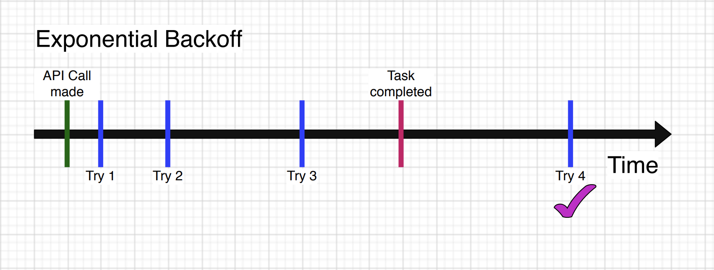
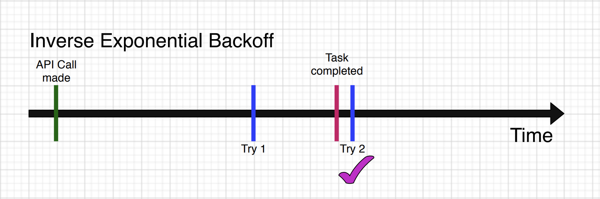

# Inverse Exponential Backoff

> Golang library for inverse exponential backoff.

## What is it?

Tasks in software systems that take a long time to complete often have asynchronous APIs. Typically, there are APIs for starting or stopping the task and checking the status. Several tasks related to resource management in cloud fall under this category. E.g. creating a new virtual machine in cloud provider, provisioning or reconfiguring a load balancer, etc.

One common programming paradigm when dealing with these systems is to call the first API for starting the task and then wait in a loop continuously checking the status for completion. This wait is often done using exponential backoff where the time interval between the checks exponentially increases with every retry.

If one goal of the busy wait is to reduce contention on the server side, the standard exponential backoff mechanism works well. However, it can result in extended wait times even in the case when the task has completed.

Here’s one example of an Exponential backoff. The X-axis is the time that has passed. The Green line represents the instant when the API call was made, the Read line represents when the API call was completed. The Blue lines represent each retry. In the case below, it took 10 time units to complete the API. Given the exponential backoff, it took 15 time units and 4 retries to actually detect that the task was completed.



Instead of an exponential backoff, one other approach would be to start with a longer time initial delay and actually reducing the time interval between subsequent retries. This can be called an “inverse exponential backoff”. The  inverse exponential backoff mimics real time probability of the completion of the task. As more time passes, the probability of the task having been completed becomes higher. Thereby, in inverse exponential backoff, as time passes, the retries become more and more frequent.

Here’s the above example of an Inverse Exponential backoff. The X-axis is the time that has passed. The Green line represents the instant when the API call was made, the Read line represents when the API call was completed. The Blue lines represent each retry. In the case below, it took 10 time units to complete the API. In the inverse exponential backoff, it took 10.5 time units and 2 retries to actually detect that the task was completed.



This inverse-exp-backoff repo is a golang implementation of the above mentioned Inverse Exponential Backoff mechanism.

## Installing

```
go get github.com/keikoproj/inverse-exp-backoff
```

### Example usage

```
import (
	iebackoff "github.com/keikoproj/inverse-exp-backoff"
)

func main() {
	for ieb, err := iebackoff.NewIEBackoff(3*time.Minute, 15*time.Second, 0.5, 20); err == nil; err = ieb.Next() {
	        appErr := sampleFunc()
	        if appErr == nil {
	                break
	        }
	}
}
```

See full example on the Golang playground [here](https://play.golang.org/p/dQmFGQskrMm).

In the above example, the NewIEBackoff function creates a new object that does inverse exponrntial backoff. It starts with an initial delay of 3 minutes. Every subsequent retry will be done by reducing the time interval by a factor of 0.5. So, the second retry will be done 1.5 minutes later, the third one 45 seconds later and so on. The minimum time interval will be 15 seconds and there will be a total of 20 retries. If the max retries (20 in the above example) are exceeded, the Next() method of the object will thrown an exception.


